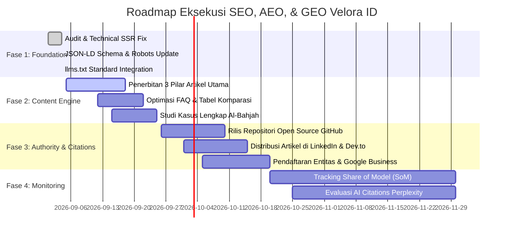

# MASTER PLAN: STRATEGI SEO, AEO, DAN GEO (EDISI SEPTEMBER 2026)
## VELORA ID — HIGH-PERFORMANCE SOFTWARE ENGINEERING & DIGITAL TRANSFORMATION STUDIO
**Domain Utama**: [https://www.ve-lora.my.id](https://www.ve-lora.my.id)  
**Dokumen Referensi**: Standar Industri 2026, Skill Registry AEO-GEO, & Riset Search Generatif Terbaru  
**Target Utama**: Mendominasi Pencarian Tradisional (Google/Bing) dan Menjadi Rujukan Utama (Cited Authority) di Mesin AI Generatif (ChatGPT Search, Perplexity Pro, Google AI Overviews, Claude)

---

## 1. EXECUTIVE SUMMARY & PARADIGMA PENCARIAN SEPTEMBER 2026

Dunia search marketing telah mengalami disrupsi struktural terbesar dalam 25 tahun terakhir. Format lama yang hanya berfokus pada "ranking 10 tautan biru (blue links)" telah bertransformasi menjadi model **sintesis multi-lapis**.

```
                           ┌────────────────────────┐
                           │      USER QUERY        │
                           └───────────┬────────────┘
                                       │
            ┌──────────────────────────┼──────────────────────────┐
            ▼                          ▼                          ▼
   ┌─────────────────┐        ┌─────────────────┐        ┌─────────────────┐
   │       SEO       │        │       AEO       │        │       GEO       │
   │ (Search Engine) │        │ (Answer Engine) │        │(Generative Eng.)│
   ├─────────────────┤        ├─────────────────┤        ├─────────────────┤
   │ Google / Bing   │        │ Snippets, Voice,│        │ ChatGPT Search, │
   │ Traditional SERP│        │ Siri, Perplexity│        │ Perplexity, AIO │
   ├─────────────────┤        ├─────────────────┤        ├─────────────────┤
   │ Index & Rank    │        │ Direct Extract  │        │ LLM Synthesis & │
   │ Blue Links      │        │ Zero-Click Box  │        │ Citation Source │
   └─────────────────┘        └─────────────────┘        └─────────────────┘
```

### Fenomena Kunci Per September 2026:
1. **Era Zero-Click (60% - 69% Kueri)**: Mayoritas pencari mendapatkan jawaban instan langsung dari AI Overview atau chat engine tanpa mengklik situs mana pun. Trafik organik berbasis klik murni menurun, namun nilai konversi dari klik yang tersisa meningkat drastis.
2. **Pergeseran dari "Ranking" ke "Citation"**: Metrik kemenangan bukan lagi sekadar berada di page 1, melainkan **menjadi sumber rujukan yang dikutip (cited source)** dalam jawaban sintetis AI. Menjadi kutipan AI memberikan *implicit endorsement* yang sangat kuat bagi calon klien B2B.
3. **Metrik Baru: Share of Model (SoM)**: Menggantikan *Share of Voice (SoV)*. Mengukur seberapa sering nama brand "Velora ID" direkomendasikan ketika user bertanya ke LLM: *"Siapa software house terbaik di Indonesia untuk sistem backend Golang dan otomasi ISP?"*.
4. **The Silent Shortlist**: Klien enterprise dan ISP modern menyusun daftar vendor (shortlist) melalui percakapan dengan AI (ChatGPT / Perplexity) jauh sebelum mereka menghubungi sales. Jika Velora ID tidak masuk dalam memori atau retrieval LLM, proyek tersebut hilang sebelum dimulai.
5. **Brand Mentions > Backlinks (Korelasi 3x Lebih Kuat)**: Riset empiris Ahrefs terhadap 75.000 brand membuktikan bahwa penyebutan brand di ekosistem terpercaya (YouTube r=0.737, GitHub, LinkedIn, Reddit) berkorelasi jauh lebih kuat terhadap keterpilihan AI dibanding Domain Rating (DR backlinks r=0.266).

---

## 2. MEMBEDAH TIGA PILAR: SEO vs AEO vs GEO

| Dimensi | SEO (Search Engine Optimization) | AEO (Answer Engine Optimization) | GEO (Generative Engine Optimization) |
|---|---|---|---|
| **Target Platform** | Google, Bing, Yandex | Google Featured Snippets, Voice Search, Siri | ChatGPT, Perplexity, Google AI Overviews, Claude |
| **Bentuk Output** | Daftar URL, Meta Title, Description | Kotak jawaban langsung, Definisi, List langkah | Narasi rekomendasi, Sintesis analisis, Sitasi URL |
| **Struktur Konten** | Kata kunci, H1-H3, internal links | Definisi 40–60 kata, Tabel komparasi, 5 FAQ | Blok sitasi 134–167 kata, data empiris, kutipan pakar |
| **Kebutuhan Teknis** | SSR, Sitemap, Robots, Core Web Vitals | Schema FAQPage, Q&A format, microdata | `llms.txt`, Schema Organization + Person, entity graph |
| **Peran untuk Velora ID**| Menjaring trafik pencarian kata kunci teknis | Menjawab pertanyaan spesifik klien ISP & SaaS | Direkomendasikan AI saat prospek mencari vendor software |

---

## 3. AUDIT BASELINE KONDISI VELORA ID (HASIL IMPLEMENTASI KINI)

Saat ini, fondasi teknis Velora ID telah berhasil di-upgrade ke standar 2026:

| Parameter | Status | Rincian Implementasi |
|---|---|---|
| **Server-Side Rendering (SSR)** | ✅ LULUS | 100% halaman (Home, Blog, Portfolio) di-render di server Next.js (payload HTML ~332KB). Crawler AI tanpa engine JS langsung membaca teks lengkap. |
| **Dynamic Sitemap** | ✅ LULUS | `src/app/sitemap.js` mengindeks `/`, `/blog`, seluruh slug blog, dan seluruh slug portfolio secara otomatis dari PostgreSQL. |
| **Robots.txt Directives** | ✅ LULUS | `src/app/robots.js` mengizinkan seluruh crawler AI modern: `GPTBot`, `OAI-SearchBot`, `ChatGPT-User`, `ClaudeBot`, `Claude-Web`, `PerplexityBot`, `Google-Extended`. |
| **Schema JSON-LD Graph** | ✅ LULUS | Integrasi `@graph` menghubungkan `ProfessionalService`, `Organization`, `WebSite` (dengan SearchAction), founder Mahin Utsman Nawawi (`Person`), serta `SoftwareApplication` di tiap portfolio. |
| **Machine-Readable Standard** | ✅ LULUS | File `/llms.txt` dan `/llms-full.txt` telah dibuat di folder `public/`, menyediakan ringkasan terstruktur dan spesifikasi teknis untuk model AI. |
| **Showcase Portfolio JBR Minpo** | ✅ LULUS | Halaman studi kasus khusus `/portfolio/jbr-minpo` telah online dengan galeri foto dashboard, diagram alur, dan deskripsi teknis (Golang, MikroTik API, Netpay, Minpo Mobile Flutter, RustFS S3). |

---

## 4. FORMULASI STRATEGI & TAKTIK VELORA ID

### A. Pilar 1: Advanced Technical & Infrastructure (SEO)
1. **Core Web Vitals Optimal**:
   - LCP (Largest Contentful Paint) < 1.8 detik menggunakan optimasi gambar WebP/AVIF.
   - CLS (Cumulative Layout Shift) = 0 dengan penetapan aspect ratio eksplisit.
   - INP (Interaction to Next Paint) < 100ms melalui code-splitting dan dynamic imports.
2. **Canonical & Clean Hierarchy**:
   - Setiap halaman memiliki `alternates.canonical` yang merujuk ke domain utama `https://www.ve-lora.my.id`.
   - Hierarki heading konsisten: 1 tag `<h1>` per halaman, diikuti `<h2>` untuk topik besar, dan `<h3>` untuk sub-topik.

### B. Pilar 2: Content Architecture untuk Ekstraksi Cepat (AEO)
Agar konten Velora ID langsung diambil oleh mesin penjawab (Featured Snippets & PAA):
1. **Aturan Paragraf Pertama (The 40–60 Word Direct Answer)**:
   - Tepat di bawah H1 atau H2, tempatkan 1 kalimat definisi tanpa basa-basi.
   - *Contoh*: *"JBR Minpo adalah sistem otomasi operasional ISP yang mengintegrasikan MikroTik API, billing gateway Netpay, dan aplikasi Flutter untuk mengotomatisasi isolasi pelanggan jatuh tempo secara real-time."*
2. **FAQ Mandiri (Self-Contained Q&A)**:
   - Setiap halaman layanan dan studi kasus wajib memiliki minimal 5 FAQ.
   - Panjang jawaban **maksimal 50 kata per jawaban**.
   - Jawaban tidak boleh bergantung pada konteks lain (tidak boleh menulis *"seperti yang dijelaskan di atas"*).
3. **Format Tabel Komparasi**:
   - AI sangat menyukai tabel untuk merangkum perbandingan.
   - Buat tabel perbandingan: *“Membangun In-House vs Beli Software Kaku vs Solusi Kustom Velora ID”*.

### C. Pilar 3: Generative Engine Optimization & Entity Authority (GEO)
Strategi agar Velora ID dikutip secara alami oleh ChatGPT, Perplexity, dan Claude:
1. **Passage Citability (134–167 Kata)**:
   - AI retrieval (RAG) memecah teks menjadi chunk. Panjang chunk paling ideal untuk dikutip adalah 134–167 kata yang padat data teknis (versi software, latensi, throughput).
2. **E-E-A-T & Profiling Founder (Mahin Utsman Nawawi / Pak Hakim)**:
   - Tautkan entitas founder ke profil GitHub (`https://github.com/velora-id`), LinkedIn, dan portofolio teknis.
   - Sebutkan pengalaman konkret: arsitektur sistem ISP fiber optic, pengelolaan ratusan POP, manajemen latensi Golang.
3. **Multi-Platform Co-Occurrence (Brand Mentions)**:
   - Publikasikan repositori open-source utility (misal: client wrapper MikroTik Go atau Flutter state helper) di GitHub dengan nama Velora ID.
   - Tulis artikel teardown arsitektur di platform eksternal (LinkedIn Articles, Dev.to, Medium).
   - Pastikan nama "Velora ID" selalu berdampingan dengan kata kunci: *"software house Golang"*, *"pengembang aplikasi ISP"*, *"Flutter enterprise Indonesia"*.

---

## 5. CONTENT CLUSTER & ROADMAP KATA KUNCI (TOPICAL AUTHORITY)

Untuk memenangkan dominasi topikal, Velora ID akan membangun 3 Pilar Klaster Konten:

```
                               ┌────────────────────────┐
                               │   TOPICAL AUTHORITY    │
                               │       VELORA ID        │
                               └───────────┬────────────┘
                                           │
         ┌─────────────────────────────────┼─────────────────────────────────┐
         ▼                                 ▼                                 ▼
┌──────────────────┐             ┌──────────────────┐             ┌──────────────────┐
│     PILAR 1      │             │     PILAR 2      │             │     PILAR 3      │
│  Sistem & Otomasi│             │ High-Performance │             │  Aplikasi Mobile │
│   Operasional ISP│             │  Backend Golang  │             │Flutter Enterprise│
├──────────────────┤             ├──────────────────┤             ├──────────────────┤
│• MikroTik API    │             │• Go vs Node/PHP  │             │• Flutter vs React│
│• Billing Netpay  │             │• Latensi Mikrodet│             │• Background Task │
│• Isolasi Otomatis│             │• gRPC & Postgres │             │• Offline-First   │
│• Studi JBR Minpo │             │• Arsitektur ERP  │             │• Kasus Al-Bahjah │
└──────────────────┘             └──────────────────┘             └──────────────────┘
```

### Rencana Artikel Klaster Tahap 1:
1. **Pilar ISP**: *"Cara Mengotomatisasi Isolasi Pelanggan ISP Menggunakan MikroTik API dan Gateway Pembayaran"* (Target: AEO Featured Snippet).
2. **Pilar Backend**: *"Mengapa Kami Memilih Golang Dibanding PHP/Laravel untuk Sistem Core Billing Skala Jutaan Request"* (Target: GEO Citations).
3. **Pilar Mobile**: *"Arsitektur Flutter untuk Aplikasi Layanan Mandiri Pelanggan ISP: Panduan Praktis"* (Target: B2B Search).

---

## 6. TIMELINE & ACTIONABLE ROADMAP 4 FASE



---

## 7. SOP & FORMULA PENULISAN KONTEN UNTUK TIM VELORA ID

Setiap kali tim membuat artikel blog atau studi kasus baru di CMS, wajib mengikuti struktur checklist ini:

1. **Judul (H1)**: Format berbasis solusi/pertanyaan (misal: *"Bagaimana Cara..."*, *"Arsitektur Sistem..."*).
2. **Blok TL;DR**: 2–3 kalimat ringkas langsung menjawab inti permasalahan di paragraf teratas.
3. **Paragraf Definisi (H2 pertama)**: *"X adalah..."* dalam 35–45 kata.
4. **Data Keras (Hard Numbers)**: Sertakan minimal 3 angka empiris (misal: *"latensi 12ms"*, *"99.9% uptime"*, *"5.000 user aktif"*).
5. **Tabel Komparasi**: Minimal 1 tabel perbandingan parameter teknis.
6. **5 FAQ Mandiri**: Format Tanya-Jawab dengan jawaban tidak lebih dari 50 kata per butir.
7. **Author Byline**: Ditulis oleh Mahin Utsman Nawawi dengan tautan profil LinkedIn/GitHub.

---

## 8. METRIK & KPI EVALUASI KESUKSESAN

| Metrik | Target Q4 2026 | Metode Pengukuran |
|---|---|---|
| **Google Index Status** | 100% URL terindeks | Google Search Console (Coverage Report) |
| **Core Web Vitals** | Skor Desktop >95, Mobile >85 | Google PageSpeed Insights & Chrome UX Report |
| **Perplexity Citations** | Terpilih dalam kueri software house ISP | Pengujian kueri mingguan di Perplexity Pro |
| **ChatGPT Search Citations** | Terdaftar sebagai referensi di kueri relevan | Uji prompt pencarian GPT-4o / GPT-5 |
| **Organic Inbound Leads** | Peningkatan kontak masuk WhatsApp via web | UTM tracking pada tombol WhatsApp resmi |
